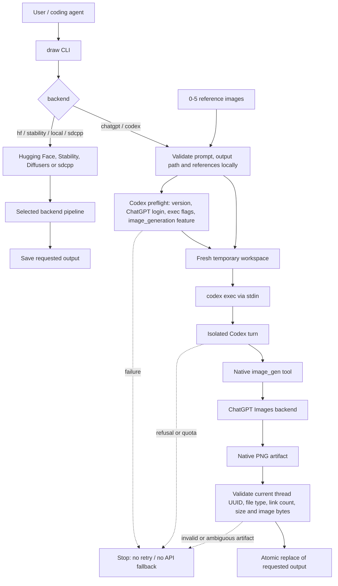

# draw-cli

Generate images from text prompts via Hugging Face Inference Providers, the Stability AI API,
local Stable Diffusion 3.5 Large, native Metal/GGUF inference, or a ChatGPT subscription
through the local Codex CLI — designed to be called from any shell, script, or AI coding agent
without leaving the terminal.

- **ChatGPT / Codex** — uses the installed official Codex CLI signed in with ChatGPT. No OpenAI API key is required; usage follows the signed-in ChatGPT plan.
- **Hugging Face / Stability / local** — Hugging Face Inference Providers (FLUX by default, SD 3.5 Large via `--model sd3.5`), the Stability AI API directly, local Diffusers, or native `stable-diffusion.cpp` with Metal/GGUF.

The default remains Hugging Face for backward compatibility. Set `DRAW_BACKEND=chatgpt` if you want ChatGPT/Codex to be the default.

## Quick start: ChatGPT plan, no API key

```bash
npm install -g @openai/codex@latest
codex login

pipx install --force git+https://github.com/alex-mextner/draw-cli
draw install-skill

draw --backend chatgpt --check
draw "a tiny astronaut cat, editorial illustration" --backend chatgpt -o cat.png
```

`codex login` must be authenticated with **ChatGPT**, not an API key. Signing in to Codex with ChatGPT uses the ChatGPT plan's Codex allowance; using a separate API key would use API billing, and this backend deliberately rejects API-key login. See OpenAI's [Codex plan documentation](https://help.openai.com/en/articles/11369540-using-codex-with-your-chatgpt-plan).

There is **no API fallback**: if native Codex image generation is unavailable, refused, rate-limited, or fails, `draw` fails too. It does not silently switch to a separately billed OpenAI API request or to Hugging Face.

## How it works



For the ChatGPT path, `draw` does **not** extract browser cookies, copy Codex auth files, scrape tokens, or automate ChatGPT Desktop. Authentication remains owned by Codex in the existing `CODEX_HOME`. The child process receives a stripped environment without OpenAI/HF API-key overrides, runs in a fresh workspace, ignores user/project Codex config and rules for that turn, disables shell/web tools, and uses a read-only shell sandbox.

The prompt is sent through stdin, not a shell command. Explicit reference images are validated first and then re-encoded into the temporary workspace. The result is accepted only from the current Codex thread namespace (or the fresh workspace artifact directory), must be one regular non-hardlinked PNG of at most **32 MiB**, and must decode as a valid image. The requested output is replaced atomically only after validation succeeds.

### Limits enforced by draw

- Prompt: at most **1 MiB** of UTF-8 text for the ChatGPT/Codex backend.
- References: at most **five** images, each at most **32 MiB**.
- Native output artifact: at most **32 MiB**.
- Output formats: `.png`, `.jpg` / `.jpeg`, `.webp`.
- Default Codex generation timeout: 600 seconds; there is no automatic generation retry.

PNG preserves the native image bytes and metadata when the native artifact is already PNG. JPEG/WebP are actually re-encoded; JPEG alpha is flattened onto white.

## ChatGPT Images 2.5: rollout vs model pinning

OpenAI announced **ChatGPT Images 2.5 on September 8, 2026** and says it is rolling out to ChatGPT, ChatGPT Work, and Codex users. See the [Images 2.5 announcement](https://openai.com/index/introducing-chatgpt-images-2-5/) and [ChatGPT release notes](https://help.openai.com/en/articles/6825453).

That does **not** mean this CLI can select `GPT-Image-2.5 Flare` or `Sunburst` by name. The native Codex image tool currently exposes prompt/reference inputs, not an image-model selector, and the inspected Codex source still uses an internal `gpt-image-2` request identifier. The server-side rollout is controlled by OpenAI. Therefore:

- `draw --backend chatgpt` uses the native image backend available to the signed-in Codex account.
- `--model` is **Hugging Face only** (and the `sd3.5`/local/stability alias); it is rejected for `chatgpt`/`codex`.
- `--codex-model` selects the reasoning model that invokes the image tool, **not** the image generator.
- Passing a GPT Image model ID as `--codex-model` is rejected rather than pretending it pinned the image model.

Detailed implementation notes: [docs/chatgpt-subscription.md](docs/chatgpt-subscription.md).

## Install

draw needs `huggingface_hub>=0.34,<2` + `Pillow` at runtime, so the recommended path is **pipx** —
an isolated venv with the deps and `draw` on your PATH. API use does not install PyTorch:

```bash
pipx install --force git+https://github.com/alex-mextner/draw-cli
draw install-skill
```

One-liner installer:

```bash
curl -fsSL https://raw.githubusercontent.com/alex-mextner/draw-cli/main/install.sh | bash
```

For an existing legacy symlink install, upgrade its runtime dependencies too:

```bash
python3 -m pip install --user --upgrade 'huggingface_hub>=0.34,<2' Pillow
```

The package depends on `huggingface_hub` for the HF backend and `Pillow` for image validation/encoding. The ChatGPT backend additionally requires a current Codex CLI available on `PATH` (or via `--codex-bin`). ChatGPT Desktop is not required.

### Token setup

Create `~/.config/draw-cli/.env`:

```
HF_TOKEN=hf_...
# Optional: required only for --backend stability
# STABILITY_API_KEY=your_key
```

Get a token at [huggingface.co/settings/tokens](https://huggingface.co/settings/tokens)
with Inference Providers permission for hosted inference. Local gated downloads need access
to the model repository after accepting its conditions. `hf auth login` is also supported.
Hosted availability, quotas and charges depend on the provider/account; a token does not
make every model available or free. Hugging Face Inference Providers use account credits
and may continue as paid usage depending on the account/billing configuration; a token does
**not** by itself make inference unlimited or free. See [Hugging Face Inference Providers pricing](https://huggingface.co/docs/inference-providers/en/pricing).

## Usage

```bash
# Hugging Face (default); HF/FLUX remains the default backend
draw "a cute robot" -o robot.png

# Override model
draw "a cute robot" --model black-forest-labs/FLUX.1-dev -o robot.png

# Stable Diffusion 3.5 Large through Hugging Face
draw "a cute robot" --model sd3.5 -o robot.png

# Stable Diffusion 3.5 Large through Stability AI directly
draw "a cute robot" --backend stability --aspect-ratio 16:9 -o robot.png

# Prompt from stdin
echo "a cute robot" | draw -o robot.png

# ChatGPT/Codex
draw "a cute robot" --backend chatgpt -o robot.png

# Prompt from stdin (ChatGPT/Codex)
printf '%s\n' "minimal geometric poster" | draw --backend chatgpt -o poster.png

# Native image edit/reference flow
draw "keep the subject; make the background warm cream" \
  --backend chatgpt -i source.png -o edited.png

# Multiple references (max 5)
draw "combine the composition and material language" \
  --backend chatgpt -i composition.png -i materials.jpg -o combined.webp

# Local preflight only; does not spend an image generation
# and does not prove current image quota/model rollout.
draw --backend chatgpt --check

# Version
draw --version
```

To make ChatGPT/Codex the default:

```dotenv
# ~/.config/draw-cli/.env
DRAW_BACKEND=chatgpt
# Optional:
# DRAW_CODEX_BIN=/opt/homebrew/bin/codex
# DRAW_CODEX_MODEL=<reasoning-model>
```

### Local Stable Diffusion 3.5 Large

Install the optional local dependencies, accept the model's Hugging Face access conditions,
and check resources before downloading weights:

```bash
# In a checkout/virtual environment:
python -m pip install ".[local]"

draw --check-resources
draw --check-resources --cache-dir /mnt/models/huggingface --json
draw "a cute robot" --backend local --seed 42 -o robot.png
```

Local generation always checks cache/output disk space, available RAM, cgroup limits and
free GPU memory before loading. It supports CUDA, Apple MPS and explicitly requested CPU,
automatic dtype/CPU offload, pinned model revisions and offline cached execution.
It never switches to a paid API when resources are insufficient. RAM/VRAM thresholds are
conservative estimates, not guarantees against OOM.

See [the SD 3.5 guide](docs/stable-diffusion-3.5.md) for pipx extras, hardware estimates,
cache accounting, offline operation and backend-specific options, and
[docs/apple-silicon.md](docs/apple-silicon.md) for the native Metal/GGUF `sdcpp` engine.

## Flags

| Flag | Applies to | Default | Meaning |
|---|---|---|---|
| `prompt` | all | — | Prompt argument; reads stdin when omitted. |
| `-o`, `--out` | all | required for generation | Output path. Not needed for `--check-resources`/`--check`. |
| `--backend` | all | `hf` | `hf`/`api`, `stability`, `local`, `sdcpp`, `chatgpt`, or `codex` (alias of `chatgpt`). |
| `--model` | hf/stability/local/sdcpp | `HF_MODEL` / FLUX default; SD 3.5 Large otherwise | HF model ID or `sd3.5` alias. Rejected for `chatgpt`/`codex`. |
| `--provider` | hf | `auto` | Hugging Face Inference Provider. HF only. |
| `--negative-prompt`, `--seed` | hf/stability/local/sdcpp | backend default | Negative prompt; seed from 0 through 4294967295. |
| `--width`, `--height` | hf/local | local: 1024 | HF/local dimensions; local must be multiples of 16. |
| `--steps`, `--guidance-scale` | hf/local | local: 28 / 3.5 | HF/local generation controls. |
| `--aspect-ratio` | stability | `1:1` | Direct Stability API only. |
| `--timeout` | hf/stability/chatgpt/codex | 300s API, 600s ChatGPT/Codex | API or Codex generation timeout in seconds. |
| `--device` | local/sdcpp | `auto` | `cuda`, `cuda:N`, `mps`, `cpu`, `auto` (sdcpp: `auto`/`metal`/`mps`/`cpu`). |
| `--dtype` | local | `auto` | `float16`, `bfloat16`, `float32`, `auto`. |
| `--offload` | local | `auto` | `none`, `model`, `sequential`, `auto`. |
| `--cache-dir`, `--revision` | local/sdcpp | HF cache / `main` | Local cache location and model revision. |
| `--offline` | local/sdcpp | off | Use a snapshot previously downloaded through draw. |
| `--check-resources` | local/sdcpp | — | Local diagnostics without weights download; no prompt/output required. |
| `--json` | local/sdcpp | off | Machine-readable resource report; exit 0 = pass, 1 = blocked. |
| `--sdcpp-bin`, `--quantization`, `--sdcpp-memory`, `--no-flash-attention`, `--native-timeout` | sdcpp | see `--help` | Native `sd-cli` engine options. |
| `-i`, `--image` | chatgpt/codex | — | Reference/edit image; repeat up to five times. |
| `--codex-bin` | chatgpt/codex | `codex` | Codex executable path/name. |
| `--codex-model` | chatgpt/codex generation | Codex default | Reasoning model, not image model. |
| `--check` | chatgpt/codex | — | Local executable/login/capability preflight; no image generation. |
| `-V`, `--version` | all | — | Print version and exit. |

Unsupported combinations fail explicitly rather than being silently ignored — for example, `--codex-model` with `--backend hf`, `--image`/`--check` without `--backend chatgpt`, or `--timeout` together with `--check`, is an argument error. Plain `--check-resources` selects `local` unless `--backend`/`DRAW_BACKEND` explicitly selects another backend.

## Environment variables

| Variable | Meaning |
|---|---|
| `DRAW_BACKEND` | Default backend: `hf`, `stability`, `local`, `sdcpp`, `chatgpt`, or `codex`; an explicit `--backend` flag wins. |
| `DRAW_CODEX_BIN` | Codex executable path/name. |
| `DRAW_CODEX_MODEL` | Optional Codex reasoning model; not the image model. |
| `CODEX_HOME` | Existing Codex home/auth location; defaults to `~/.codex`. |
| `HF_TOKEN` | Hugging Face token; alternatively use a cached `hf auth login`. |
| `HF_MODEL` | Default Hugging Face model ID. |
| `STABILITY_API_KEY` | Direct Stability AI API key; not an HF token. |
| `HF_HOME`, `HF_HUB_CACHE` | Hugging Face cache roots, honored by local mode. |
| `HF_HUB_OFFLINE` | Set to `1` for local offline mode. |

Variables are auto-loaded from `~/.config/draw-cli/.env` without replacing existing environment values.

## Testing

The normal suite is offline: it uses a fake executable subprocess and never reads real Codex credentials or spends image usage.

```bash
python -m pip install 'pytest>=8,<9' Pillow
python -m pytest tests/ -q
```

CI runs the suite on Python 3.9 and 3.12 on Linux, plus a macOS contract job for the Codex adapter. There are also explicitly opt-in live tests; see [docs/chatgpt-subscription.md](docs/chatgpt-subscription.md). The live path is not enabled in CI because it requires a user's ChatGPT login and may consume plan usage.

The adversarial review and the RED→GREEN cases added for this backend are documented in [docs/adversarial-review.md](docs/adversarial-review.md).

## Requirements

- Python 3.9+ for the base CLI; Python 3.10+ recommended for the optional local stack.
- [`huggingface_hub`](https://pypi.org/project/huggingface_hub/) (>=0.34,<2) and `Pillow`.
- Optional `[local]` dependencies and sufficient resources for local SD 3.5 Large.
- The ChatGPT/Codex backend additionally requires a current Codex CLI on `PATH` signed in with `codex login` (ChatGPT plan, not an API key).

## Agent skill

```bash
draw install-skill
```

This installs the `draw` Agent Skill and small discovery blurbs for detected agent harnesses. The registration is idempotent — it writes a skill file to `~/.agents/skills/draw/` so Claude Code, Codex, opencode, and Gemini harnesses know `draw` exists; the one-liner installer runs it automatically. A recursion guard prevents the Codex subprocess used by `draw` from recursively invoking `draw` again.

---

## How draw compares

The other text-to-image CLIs trade off between *simple-but-locked-in* and
*powerful-but-heavy*. Single-vendor tools (dallecli, openai-cli-art) are hard-wired
to one provider. General runners (Replicate CLI, simonw `llm`) cover broader AI
workflows. Local engines such as ComfyUI provide substantially more workflow control.

`draw` keeps **one command**, **stdin-pipeable prompts**, **plain image output**,
**no local server**, and **agent-skill registration**, while covering hosted APIs
(Hugging Face, Stability), local Diffusers, native Metal/GGUF inference, and a
**ChatGPT subscription with no API key** through the local Codex CLI. Its base API
installation stays lightweight; SD 3.5 local inference is an explicit optional
extra, not a large download imposed on every user. It deliberately does one thing
— prompt in, image file out — and leaves editing/filtering to image tools.

## Ecosystem

Part of the [HyperIDE.ai](https://hyperide.ai) agent toolchain:

- [tg-cli](https://github.com/alex-mextner/tg-cli) — Telegram CLI / agent bridge.
- [review-cli](https://github.com/alex-mextner/review-cli) — multi-model read-only review tooling.
- [rig-cli](https://github.com/alex-mextner/rig-cli) — dev-environment reconciliation and CI/skill setup.
- [agent-tools](https://github.com/alex-mextner/agent-tools) — shared agent tools/catalog.
- [3d-cli](https://github.com/alex-mextner/3d-cli) — scriptable FDM/3D workflow CLI.
- [hyperide.ai](https://hyperide.ai) — design/code tooling for React workflows.
