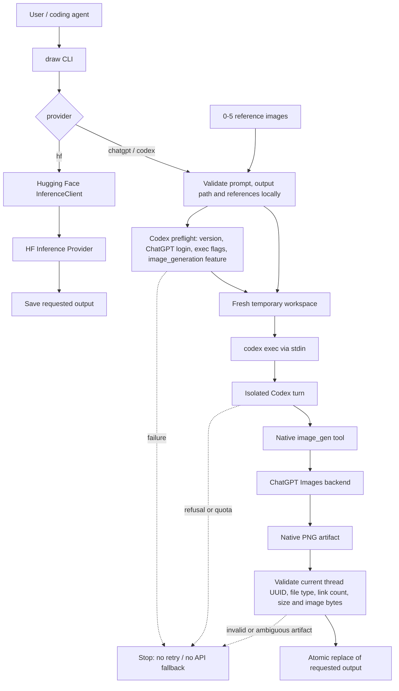

# draw-cli

`draw` is a small CLI for generating image files from a prompt. It has two backends:

- **ChatGPT / Codex** — uses the installed official Codex CLI signed in with ChatGPT. No OpenAI API key is required; usage follows the signed-in ChatGPT plan.
- **Hugging Face** — uses `huggingface_hub.InferenceClient` with an `HF_TOKEN` and a selected HF model.

The default remains Hugging Face for backward compatibility. Set `DRAW_PROVIDER=chatgpt` if you want ChatGPT/Codex to be the default.

## Quick start: ChatGPT plan, no API key

```bash
npm install -g @openai/codex@latest
codex login

pipx install --force git+https://github.com/alex-mextner/draw-cli
draw install-skill

draw --provider chatgpt --check
draw "a tiny astronaut cat, editorial illustration" --provider chatgpt -o cat.png
```

`codex login` must be authenticated with **ChatGPT**, not an API key. Signing in to Codex with ChatGPT uses the ChatGPT plan's Codex allowance; using a separate API key would use API billing, and this backend deliberately rejects API-key login. See OpenAI's [Codex plan documentation](https://help.openai.com/en/articles/11369540-using-codex-with-your-chatgpt-plan).

There is **no API fallback**: if native Codex image generation is unavailable, refused, rate-limited, or fails, `draw` fails too. It does not silently switch to a separately billed OpenAI API request or to Hugging Face.

## How it works


```mermaid
flowchart TD
    A[User / coding agent] --> B[draw CLI]
    B --> C{provider}

    C -->|hf| H[Hugging Face InferenceClient]
    H --> HP[HF Inference Provider]
    HP --> HS[Save requested output]

    C -->|chatgpt / codex| V[Validate prompt, output path and references locally]
    R[0-5 reference images] --> V
    V --> P[Codex preflight: version, ChatGPT login, exec flags, image_generation feature]
    P --> W[Fresh temporary workspace]
    V --> W
    W --> E[codex exec via stdin]
    E --> I[Isolated Codex turn]
    I --> G[Native image_gen tool]
    G --> S[ChatGPT Images backend]
    S --> N[Native PNG artifact]
    N --> Q[Validate current thread UUID, file type, link count, size and image bytes]
    Q --> O[Atomic replace of requested output]

    P -. failure .-> X[Stop: no retry / no API fallback]
    I -. refusal or quota .-> X
    Q -. invalid or ambiguous artifact .-> X
```

For the ChatGPT path, `draw` does **not** extract browser cookies, copy Codex auth files, scrape tokens, or automate ChatGPT Desktop. Authentication remains owned by Codex in the existing `CODEX_HOME`. The child process receives a stripped environment without OpenAI/HF API-key overrides, runs in a fresh workspace, ignores user/project Codex config and rules for that turn, disables shell/web tools, and uses a read-only shell sandbox.

The prompt is sent through stdin, not a shell command. Explicit reference images are validated first and then re-encoded into the temporary workspace. The result is accepted only from the current Codex thread namespace (or the fresh workspace artifact directory), must be one regular non-hardlinked PNG of at most **32 MiB**, and must decode as a valid image. The requested output is replaced atomically only after validation succeeds.

### Limits enforced by draw

- Prompt: at most **1 MiB** of UTF-8 text for the ChatGPT/Codex backend.
- References: at most **five** images, each at most **32 MiB**.
- Native output artifact: at most **32 MiB**.
- Output formats: `.png`, `.jpg` / `.jpeg`, `.webp`.
- Default Codex generation timeout: 600 seconds; there is no automatic generation retry.

PNG preserves the native image bytes and metadata when the native artifact is already PNG. JPEG/WebP are actually re-encoded; JPEG alpha is flattened onto white.

## ChatGPT Images 2.5: rollout vs model pinning

OpenAI announced **ChatGPT Images 2.5 on September 8, 2026** and says it is rolling out to ChatGPT, ChatGPT Work, and Codex users. See the [Images 2.5 announcement](https://openai.com/index/introducing-chatgpt-images-2-5/) and [ChatGPT release notes](https://help.openai.com/en/articles/6825453).

That does **not** mean this CLI can select `GPT-Image-2.5 Flare` or `Sunburst` by name. The native Codex image tool currently exposes prompt/reference inputs, not an image-model selector, and the inspected Codex source still uses an internal `gpt-image-2` request identifier. The server-side rollout is controlled by OpenAI. Therefore:

- `draw --provider chatgpt` uses the native image backend available to the signed-in Codex account.
- `--model` is **Hugging Face only**.
- `--codex-model` selects the reasoning model that invokes the image tool, **not** the image generator.
- Passing a GPT Image model ID as `--codex-model` is rejected rather than pretending it pinned the image model.

Detailed implementation notes: [docs/chatgpt-subscription.md](docs/chatgpt-subscription.md).

## Hugging Face backend

```bash
# ~/.config/draw-cli/.env
HF_TOKEN=hf_...

# default HF model
draw "a cute robot" -o robot.png

# explicit HF model
draw "a cute robot" --model black-forest-labs/FLUX.1-dev -o robot.png
```

Hugging Face Inference Providers use account credits and may continue as paid usage depending on the account/billing configuration. A token authenticates the request; it does **not** by itself make inference unlimited or free. See [Hugging Face Inference Providers pricing](https://huggingface.co/docs/inference-providers/en/pricing).

## Install

Recommended: **pipx**, which keeps Python dependencies isolated.

```bash
pipx install --force git+https://github.com/alex-mextner/draw-cli
draw install-skill
```

One-liner installer:

```bash
curl -fsSL https://raw.githubusercontent.com/alex-mextner/draw-cli/main/install.sh | bash
```

The package depends on `huggingface_hub` for the HF backend and `Pillow` for image validation/encoding. The ChatGPT backend additionally requires a current Codex CLI available on `PATH` (or via `--codex-bin`). ChatGPT Desktop is not required.

## Usage

```bash
# Hugging Face (default)
draw "a cute robot" -o robot.png

# ChatGPT/Codex
draw "a cute robot" --provider chatgpt -o robot.png

# Prompt from stdin
printf '%s\n' "minimal geometric poster" | draw --provider chatgpt -o poster.png

# Native image edit/reference flow
draw "keep the subject; make the background warm cream" \
  --provider chatgpt -i source.png -o edited.png

# Multiple references (max 5)
draw "combine the composition and material language" \
  --provider chatgpt -i composition.png -i materials.jpg -o combined.webp

# Local preflight only; does not spend an image generation
# and does not prove current image quota/model rollout.
draw --provider chatgpt --check

# Version
draw --version
```

To make ChatGPT/Codex the default:

```dotenv
# ~/.config/draw-cli/.env
DRAW_PROVIDER=chatgpt
# Optional:
# DRAW_CODEX_BIN=/opt/homebrew/bin/codex
# DRAW_CODEX_MODEL=<reasoning-model>
```

## CLI flags

| Flag | Applies to | Default | Meaning |
|---|---|---|---|
| `prompt` | both | — | Prompt argument; reads stdin when omitted. |
| `-o`, `--out` | both | required | Output path. Not needed for `--check`. |
| `--provider` | both | `hf` | `hf`, `chatgpt`, or `codex` (`codex` is an alias). |
| `--model` | HF | `HF_MODEL` / FLUX default | Hugging Face model ID. |
| `-i`, `--image` | ChatGPT | — | Reference/edit image; repeat up to five times. |
| `--codex-bin` | ChatGPT | `codex` | Codex executable path/name. |
| `--codex-model` | ChatGPT generation | Codex default | Reasoning model, not image model. |
| `--timeout` | ChatGPT generation | `600` | Generation timeout in seconds. |
| `--check` | ChatGPT | — | Local executable/login/capability preflight; no image generation. |
| `-V`, `--version` | both | — | Print version and exit. |

Provider-specific options fail closed instead of being silently ignored. For example, `--codex-model` with `--provider hf`, or `--timeout` together with `--check`, is an argument error.

## Environment variables

| Variable | Meaning |
|---|---|
| `DRAW_PROVIDER` | Default provider: `hf`, `chatgpt`, or `codex`. |
| `DRAW_CODEX_BIN` | Codex executable path/name. |
| `DRAW_CODEX_MODEL` | Optional Codex reasoning model; not the image model. |
| `CODEX_HOME` | Existing Codex home/auth location; defaults to `~/.codex`. |
| `HF_TOKEN` | Hugging Face token; HF backend only. |
| `HF_MODEL` | Default Hugging Face model ID. |

## Testing

The normal suite is offline: it uses a fake executable subprocess and never reads real Codex credentials or spends image usage.

```bash
python -m pip install 'pytest>=8,<9' Pillow
python -m pytest tests/ -q
```

CI runs the suite on Python 3.9 and 3.12 on Linux, plus a macOS contract job for the Codex adapter. There are also explicitly opt-in live tests; see [docs/chatgpt-subscription.md](docs/chatgpt-subscription.md). The live path is not enabled in CI because it requires a user's ChatGPT login and may consume plan usage.

The adversarial review and the RED→GREEN cases added for this backend are documented in [docs/adversarial-review.md](docs/adversarial-review.md).

## Agent skill

```bash
draw install-skill
```

This installs the `draw` Agent Skill and small discovery blurbs for detected agent harnesses. The registration is idempotent. A recursion guard prevents the Codex subprocess used by `draw` from recursively invoking `draw` again.

## Ecosystem

Part of the [HyperIDE.ai](https://hyperide.ai) agent toolchain:

- [tg-cli](https://github.com/alex-mextner/tg-cli) — Telegram CLI / agent bridge.
- [review-cli](https://github.com/alex-mextner/review-cli) — multi-model read-only review tooling.
- [rig-cli](https://github.com/alex-mextner/rig-cli) — dev-environment reconciliation and CI/skill setup.
- [agent-tools](https://github.com/alex-mextner/agent-tools) — shared agent tools/catalog.
- [3d-cli](https://github.com/alex-mextner/3d-cli) — scriptable FDM/3D workflow CLI.
- [hyperide.ai](https://hyperide.ai) — design/code tooling for React workflows.
